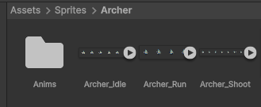
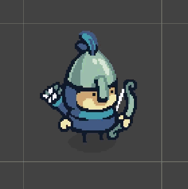
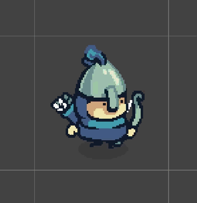
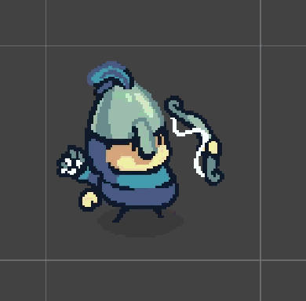
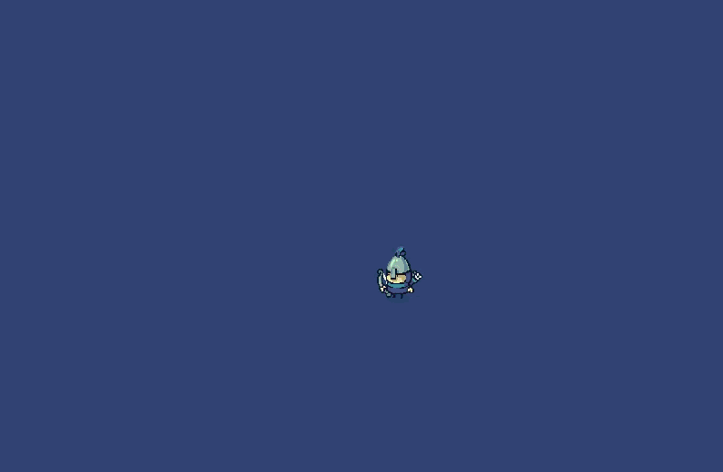

# Blog post #3
## Milestone #1: The basics

The game project was officially started by making a Unity 2D universal project, doing an initial commit, and pushing it to my GMD repo.

I then set my eyes on the first actual goal/task that involved some game development: "Moving player character".
I knew that, to keep my primate brain entertained, I needed my character to be something more exciting than a moving rectangle, so I went online to find a character.

I ended to striking gold, and found a whole asset pack called "[Tiny Swords](https://pixelfrog-assets.itch.io/tiny-swords)". Which contains a bunch of animated top-down medieval assets, perfect for pleasing primate brains.
All rights go to the creator "Pixel Frog", I did not create any of these assets, bla bla bla...

As a beginning, I only wanted a player character, which needed to be able to shoot some projectiles/bullets. So I chose the archer unit and imported the animation sprites into Unity:

After some splicing (Making the different frames/cells of the animation the same size) and pacing/timing in the Animation window, I ended up with 3 different animations for my player character: Idle, Move and Shoot

  

After this, I made 2 scripts for controlling player movement and the animation state of the player. These allow the player to move in 8 different directions with the WASD or arrow keys, which will later be changed to the VIA Arcade controls, and for the different animations to play at the right time, although for now it is only move and idle, since the shooting has not been implemented yet.
The player movement for now looks something like this:

