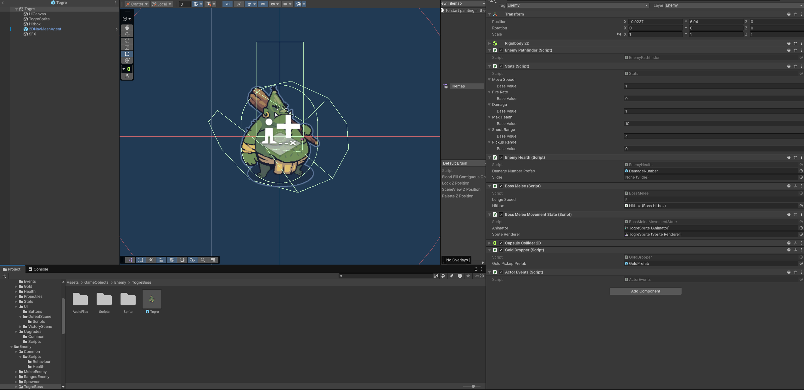
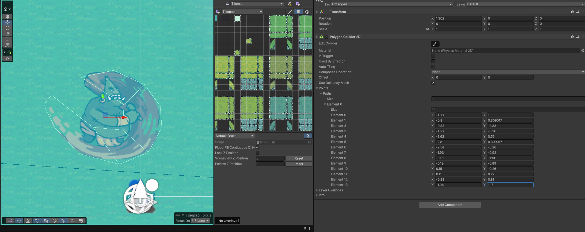
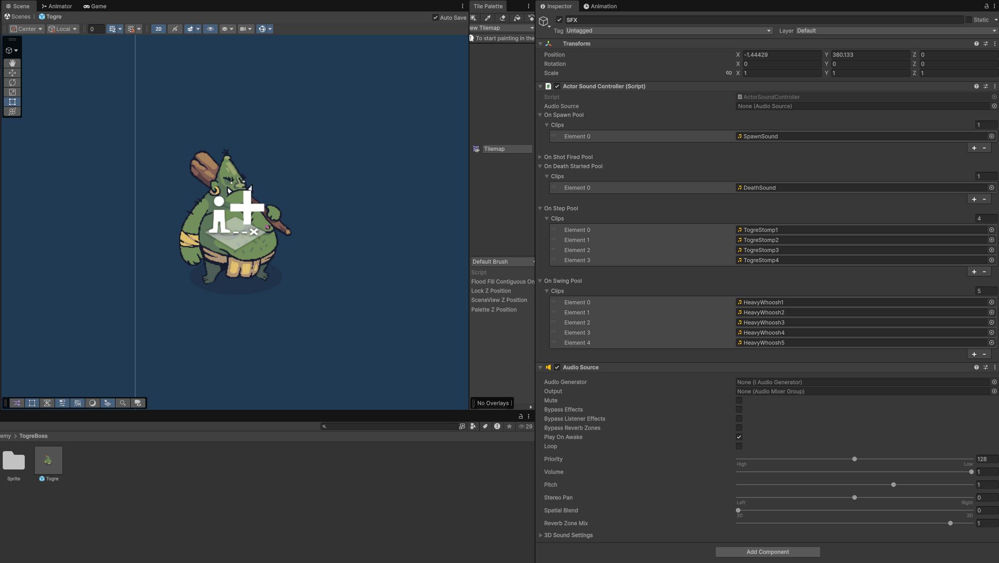
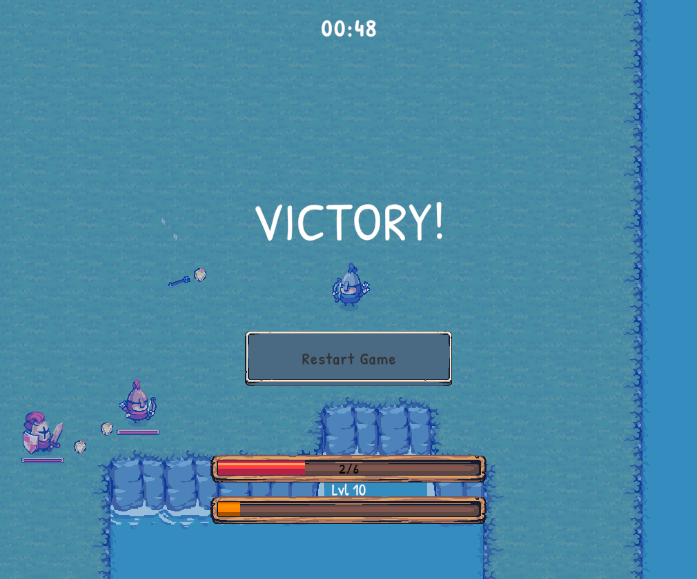
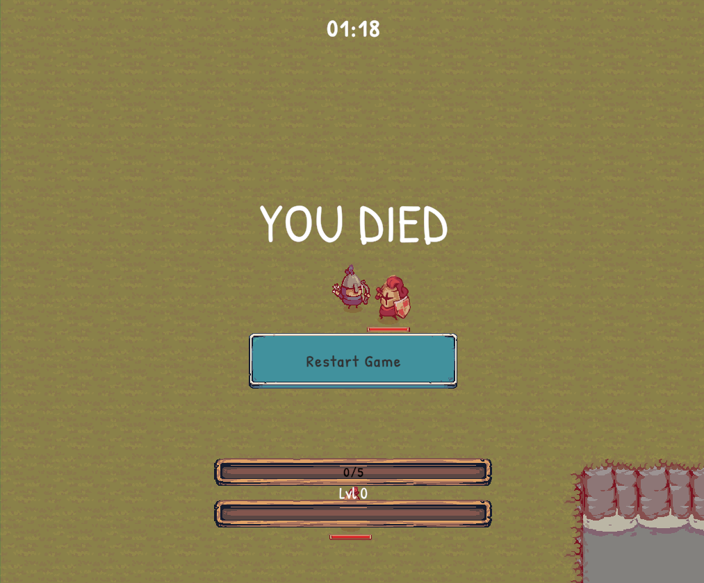

# Blog post #5
## Milestone #3: Boss enemy, events, sounds, and everything else that snuck in

This milestone had one headline feature: a boss enemy... And then proceeded to pull half the codebase along with it. Turns out adding a boss that has a death animation, its own music, a health bar, sound effects, and the ability to trigger a win condition requires a surprising amount of infrastructure. The good news is that most of that infrastructure made the rest of the game better too, not just the boss.

Looking at Milestone #3 from the design document, the goals were:
* Boss enemy with a proper fight sequence
* Win/lose conditions
* Music and sound effects
* Balance tuning

All of that shipped. Some of it got more interesting than expected. Let's get into it.

---

## Boss enemy architecture

The boss is a melee enemy, so it shares a lot of infrastructure with the existing melee knight: `EnemyPathfinder`, `Stats`, `EnemyHealth`, and `Rigidbody2D`-driven movement. What it doesn't share is any of its behaviour scripts. Same principle as last time: each enemy type gets its own dedicated scripts rather than one shared script full of `if (enemyType == Boss)` branches. The boss got `BossMelee`, `BossMeleeMovementState`, `BossMeleeAnimationEvents`, and `BossHitbox`. `BossMeleeAnimationEvents` lives in the sprite and sends animation events from the characters sprite back to the parent gameobject where the `ActorEvents` event bus lives, which invokes actions that the different components listens to, to perform their respective jobs. All characters have been updated to use this event bus approach.



## State machine

The boss has five states: Idle, Move, Windup, Attack, Recover, and Die. The state machine lives in `BossMeleeMovementState` and works the same way as the regular melee enemy: animation events on the clips drive transitions rather than timers or polling.

The attack sequence goes: **Windup → Attack → Recover**. During Windup the boss stands still, which acts as a visual telegraph so the player has a chance to dodge. At the end of the Windup clip an animation event fires, which snapshots the player's current position as a lunge direction. During Attack the boss lunges at `lungeSpeed` in that fixed direction for the full duration of the clip. He doesn't stop when he gets there, the animation ending is the only thing that stops him. Recover plays before he can attack again.

The direction is stored as a normalised `Vector2` rather than a target position. An earlier version stored the target position and recalculated direction each frame, which caused the boss to oscillate around the target once he reached it. Fixed direction avoids that entirely.

Also, the boss' name... You can figure that out by yourselves ;)


## Hitbox

Rather than dealing damage via `OnTriggerStay2D` like the regular melee enemy, the boss has a dedicated child `BossHitbox` GameObject with a `BoxCollider2D` that is disabled by default. Animation events `OnHitboxOpen` and `OnHitboxClose` toggle it at the right frames of the attack animation:

```csharp
public void OnHitboxOpen()  => _events.HitboxOpen();
public void OnHitboxClose() => _events.HitboxClose();
```

`BossHitbox` subscribes to those events and enables or disables its collider accordingly. When the enabled collider detects the player it fires its own C# event, and `BossMelee` subscribes to deal damage. This gives frame-accurate hit detection that matches the visual swing, which `OnTriggerStay2D` can't do because it keeps firing for as long as two colliders overlap.

Here's how the hitbox outlining looks, made by freezing the swing animation and making a polygon collider that fits the space of the swinging club:


## Die animation

Previously `EnemyHealth` destroyed the GameObject immediately on death. For the boss that's a problem because the death animation needs time to play. The solution was to split death into two phases.

`EnemyHealth` now fires an `OnDeathStarted` event when health hits zero. If something subscribes, destruction is deferred. If nothing subscribes (regular enemies), `FinaliseDeath()` is called immediately as a fallback, so existing enemies are completely unaffected.

```csharp
if (_currentHealth == 0)
{
    if (_events.HasDeathStartedListeners)
        _events.DeathStarted();
    else
        FinaliseDeath();
}
```

`BossMeleeMovementState` subscribes to `OnDeathStarted`, plays the Die animation, and locks all other state transitions. At the last frame of the Die clip, an animation event fires `BossMeleeAnimationEvents.OnDeathAnimationComplete`. `BossMeleeMovementState` subscribes to that and calls `EnemyHealth.FinaliseDeath()`, which fires `OnDeath`, drops gold, and destroys the GameObject.

Nothing touches anything it shouldn't know about: the animation events script doesn't reference `EnemyHealth`, and `EnemyHealth` doesn't know anything about the animation system.


## Boss timer

The boss spawns on a countdown. `BossTimer` is a standalone component with a `duration` field and a `TMP_Text` reference for the on-screen display. It counts down in `Update`, fires an `OnTimerComplete` C# event when it hits zero, and hides the text. When `ResetAndStart()` is called, which the spawner does on boss death, the text reappears and the countdown starts again.

It's deliberately decoupled from the spawner. The spawner subscribes to the timer's event rather than the timer knowing anything about spawning.

See the timer at the top of the screen:


---

## ActorEvents: per-actor event bus

Adding the boss exposed a technical debt goblin that had been lurking in the existing code: The animation events scripts (`EnemyMeleeAnimationEvents`, `EnemyRangedAnimationEvents`, `BossMeleeAnimationEvents`, `PlayerAnimationEvents`) were all directly coupled to the movement state scripts on the same GameObject. Each one held a serialized reference to its sibling and called methods on it directly. This meant:

- Adding a new subscriber (like a sound controller) required editing the animation events script
- Components couldn't be reused across enemy types
- Unit A knowing about Unit B's internals is exactly the kind of coupling that causes problems later

The fix was a shared `ActorEvents` component that sits on every actor's root GameObject. Animation events scripts now fire into `ActorEvents` instead of calling siblings directly. Everything else subscribes to the events it cares about in `OnEnable`/`OnDisable`. Neither side knows the other exists.

```csharp
public class ActorEvents : MonoBehaviour
{
    public event Action OnDeathStarted;
    public event Action OnDeath;
    public event Action OnShotFired;
    public event Action OnWindupComplete;
    public event Action OnHitboxOpen;
    public event Action OnHitboxClose;
    public event Action OnDeathComplete;
    public event Action OnStep;
    public event Action OnSwing;
    // ...

    public void DeathStarted()    => OnDeathStarted?.Invoke();
    public void ShotFired()       => OnShotFired?.Invoke();
    public void HitboxOpen()      => OnHitboxOpen?.Invoke();
    public void Step()            => OnStep?.Invoke();
    public void Swing()           => OnSwing?.Invoke();
    // ...
}
```

This is the **Observer pattern** applied at the actor level. It's the same idea as the `Stat.OnValueChanged` event from last milestone, instead of A calling B directly, B just listens for something it cares about. The difference is that `ActorEvents` is the single place where all of those actor-level signals live, so any component on the same GameObject can subscribe to events without knowing anything about the other components.

## GlobalEvents: game-wide event bus

`ActorEvents` handles events between components on the same GameObject. But some things are relevant to the whole game: the boss spawning, the boss dying, the player dying. These needed a different solution.

For those, a static `GlobalEvents` class was added. Being static means there's no scene setup, no serialized reference to lose across scene loads, and any script anywhere can subscribe or fire without needing a reference:

```csharp
public static class GlobalEvents
{
    public static event Action OnBossSpawned;
    public static event Action OnBossDefeated;
    public static event Action OnPlayerDied;
    public static event Action OnPlayerWon;
    public static event Action<int> OnLevelUp;

    public static void BossSpawned()      => OnBossSpawned?.Invoke();
    public static void BossDefeated()     => OnBossDefeated?.Invoke();
    public static void PlayerDied()       => OnPlayerDied?.Invoke();
    public static void PlayerWon()        => OnPlayerWon?.Invoke();
    public static void LevelUp(int level) => OnLevelUp?.Invoke(level);
}
```

The spawner fires `GlobalEvents.BossSpawned()` and `GlobalEvents.BossDefeated()`. `PlayerHealth` fires `GlobalEvents.PlayerDied()` on death. Nothing else needs to reference the spawner or `PlayerHealth` to react to those moments, they just subscribe to the global event they care about. The music controller, the defeat screen, and the boss health bar all use this.

The one thing to watch with static events: **always unsubscribe in `OnDisable`**. Static events persist across scene loads, so a destroyed object that forgot to unsubscribe will cause a null reference exception the next time the event fires.

With all these event busses being made and mentioned, it's also important to remember that components can get too decoupled: resulting in not being able to follow method calls, harder debugging and taking a bit of a performance hit. For a game this size and with actors with this complexity, I found it to be an excellent solution for making an event driven game.

## Music controller

`MusicController` is a scene component that subscribes to `GlobalEvents` and swaps `AudioClip`s on an `AudioSource` in response:

```csharp
private void OnEnable()
{
    GlobalEvents.OnBossSpawned  += PlayBossMusic;
    GlobalEvents.OnBossDefeated += PlayNormalMusic;
    GlobalEvents.OnPlayerDied   += PlayDefeatMusic;
    GlobalEvents.OnPlayerWon    += PlayVictoryMusic;
}
```

It knows about four clips: normal music, boss music, defeat music, and victory music. Boss spawned → boss music. Boss defeated → back to normal. Player died → defeat music. Player won → victory music. Adding a new music state is a new clip field and a new subscription. The `Play` method guards against restarting a clip that's already playing:

```csharp
private void Play(AudioClip clip)
{
    if (clip == null || audioSource.clip == clip) return;
    audioSource.clip = clip;
    audioSource.Play();
}
```

Play the game to experience the lovely music ;)

## Actor sound controller

`ActorSoundController` is the per-actor equivalent of `MusicController`. It sits on actor prefabs alongside `ActorEvents` and uses `PlayOneShot` so multiple sounds can overlap naturally — important for things like footsteps that fire rapidly.

Each event gets a `SoundPool`:

```csharp
[Serializable]
public struct SoundPool
{
    [SerializeField] private AudioClip[] clips;

    public AudioClip Pick()
    {
        if (clips == null || clips.Length == 0) return null;
        return clips[Random.Range(0, clips.Length)];
    }
}
```

Assigning multiple clips to a pool gives variation without any extra logic at the call site: stomp 1, stomp 2, stomp 3 in the pool, and the system picks one at random each time `OnStep` fires. Currently wired to `OnShotFired`, `OnDeathStarted`, `OnStep`, `OnSwing`, and spawn (in `Start`). Adding a new sound effect is: add a clip to the pool in the Inspector, done.



---

## GoldDropper extraction

Gold dropping was handled inside `EnemyHealth.FinaliseDeath()`, which had no business knowing about gold. This was extracted into a standalone `GoldDropper` component following the single responsibility principle. `GoldDropper` subscribes to `ActorEvents.OnDeath` and handles the drop itself. `EnemyHealth` no longer has any knowledge of gold. The spawner now sets the gold amount via `GetComponent<GoldDropper>()?.SetAmount(...)` instead.

## Win and lose conditions

With `GlobalEvents` in place, wiring up a defeat screen and a victory screen was straightforward. Both follow the same structure: a `MonoBehaviour` with a panel reference, subscribe to a global event in `OnEnable`, show the panel and pause the game when it fires.

**Defeat screen** subscribes to `GlobalEvents.OnPlayerDied`, which `PlayerHealth` already fires:

```csharp
private void OnEnable()  => GlobalEvents.OnPlayerDied += Show;
private void OnDisable() => GlobalEvents.OnPlayerDied -= Show;

private void Show()
{
    panel.SetActive(true);
    Time.timeScale = 0f;
}
```

**Victory condition** subscribes to `GlobalEvents.OnLevelUp` (more on that below), checks if the level has reached the win threshold, and fires `GlobalEvents.PlayerWon()`:

```csharp
private void CheckVictory(int level)
{
    if (level >= winLevel)
        GlobalEvents.PlayerWon();
}
```

**Victory screen** subscribes to `GlobalEvents.OnPlayerWon`, same panel-and-pause pattern as the defeat screen.

The restart button was extracted into its own `RestartButton` component so it can be dropped onto any button in any screen:

```csharp
[RequireComponent(typeof(Button))]
public class RestartButton : MonoBehaviour
{
    private void Start() => GetComponent<Button>().onClick.AddListener(Restart);

    private void Restart()
    {
        Time.timeScale = 1f;
        SceneManager.LoadScene(SceneManager.GetActiveScene().buildIndex);
    }
}
```

Attach it to the Button GameObject, it wires itself up. Same button, defeat screen, victory screen, wherever.




## OnLevelUp as a GlobalEvent

`PlayerGold` used to own a static `OnLevelUp` event. `UpgradeScreen` and `VictoryCondition` both subscribed to it, meaning both had to import `PlayerGold` just to listen to a level-up, even though they don't care about gold at all, which just feels wrong.

`OnLevelUp` was moved to `GlobalEvents` and now passes the current level as a parameter:

```csharp
public static event Action<int> OnLevelUp;
public static void LevelUp(int level) => OnLevelUp?.Invoke(level);
```

`PlayerGold` fires `GlobalEvents.LevelUp(Level)` when it levels up. `UpgradeScreen` and `VictoryCondition` subscribe to `GlobalEvents.OnLevelUp` instead. Neither of them imports `PlayerGold` anymore. `VictoryCondition` in particular got nice and clean: it's no longer coupled to `PlayerGold` and just reads the level from the event parameter:

```csharp
private void CheckVictory(int level)
{
    if (level >= winLevel)
        GlobalEvents.PlayerWon();
}
```

## Balance tuning

The upgrade bonuses were making the player too strong too fast. Rather than going into each `UpgradeDefinition` ScriptableObject and hand-adjusting every value, a single `bonusScale` multiplier was added to `UpgradeScreen`:

```csharp
[SerializeField] private float bonusScale = 1f;
```

Applied at pick time:

```csharp
bool scaleBonus = definition.statType != StatType.Damage && definition.statType != StatType.MaxHealth;
stat?.AddBonus(definition.bonusAmount * (scaleBonus ? bonusScale : 1f));
```

`Damage` and `MaxHealth` are excluded from scaling because they're integer-driven stats. Fractional bonuses on those would either get rounded away or cause awkward half-health situations. Speed, fire rate, range, and pickup radius all scale cleanly. Set `bonusScale` to `0.5` in the Inspector to halve all of those bonuses without touching a single asset.

More balancing and tuning would be a very good idea, but I feel that the difficulty of the game as of now is quite balanced: hard and challenging. You have to learn the attack patterns of especially the boss, dying in the process. It's much like software engineering, you have to iterate and learn from your mistakes to achieve victory. (Come on, you cannot not love this statement)

---

## Next up
* Final blogpost: Showing off the game in its entirety.
* Optionals i hope i get to
  * Main menu
  * Change win condition to kill boss that spawns after 5 minutes. Objective is to build up character in those 5 minutes, and then defeat a harder tuned boss.

Notes after external tester:
* Make a sound when player is hit
* Make selected upgrade more obvious
* Titles on upgrade cards needs reducing.
