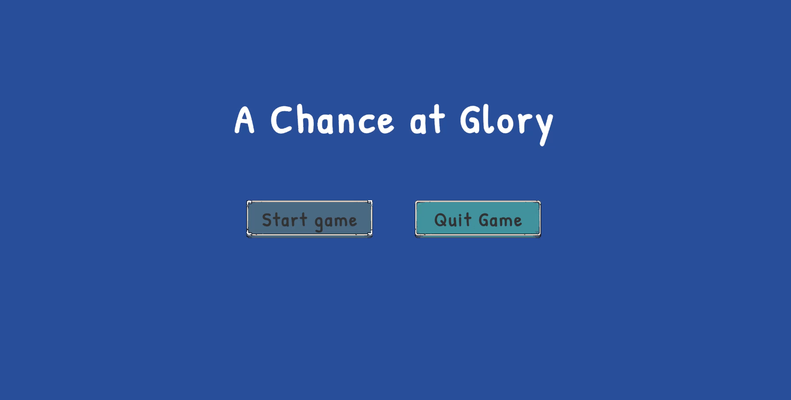

# Blog Post #6

Since the last blog post, I have worked on adding an extra few things to the game, making it feel alot more polished:

A main menu:

And changed the win condition to be kill the boss after 5 minutes instead of just reach a certain level. 

I also added/changed:
- The camera locks into place when the boss fight starts, making it harder for the player to just kite the boss around the map, by being locked in an arena
- New upgrades: Projectiles can now go through more than 1 enemy, and bounce of the camera walls, really adding to the bullethell vibe
- Hit sound when the player gets hit

And now for the showcase:
# Presenting...
# A Chance at Glory
## A roguelite/bullet-hell hybrid
"In a game where each run is different, upgrade your character by defeating the ever growing waves of enemies, to defeat the final boss"

The game is played in "runs", each lasting 5-10 minutes. The runs are split into 3 stages:
## Early game
The player runs around, getting their bearings, kills their first few enemies and getting their first upgrade. The pace is pretty slow at this stage, but it picks up pretty fast.

## Mid game
The number of enemies increases significantly, forcing the player to run around avoiding enemies, while trying to collect gold for upgrades, to better handle the bigger waves. This is where the game gets really challenging, especially if wrong upgrades were chosen.

## Late game (bossfight)
Once the timer reaches zero, the boss spawns: locking the player in an invisible arena where they must defeat the boss to win the game. This is the ultimate test of the build the player has made in the current run:

## Aesthetics
As mentioned in the game design document, the game aims to please the aesthetics:
- Sensation: Sense pleasure from avoiding projectiles and killing enemies
- Challenge: Fast-paced rounds with rising difficulty, testing the players reflexes and overview
- Mastery: Learning to combat the different enemy types, testing out different builds makes the game more interesting long-term

## Overall architecture and topics
The game has been implemented as component-based and event-driven. This promotes Single responsibility principle, where each component is responsible for one thing. The event busses provides decoupling of components, to avoid unnecessary dependencies.

### Topics from the requirements:
- Scripting: A script for every component: movement behaviours, attack patterns, state machines to name a few
- Input and vectors: Player input is read as a direction vector and smoothly applied to the player's physics body each frame
- Physics: Rigidbodies and colliders controls when projectiles hit or miss, also deciding where actors can and can't move on the map
- Graphics, animations and audio: Imported spritesheets were turned into animations for the actors. Music and sound effects are played at different events, run by dedicated SFX and music controller components.
- Game AI: State machines control the behavior and animation of actors, along with navmesh controlling the movement.
- User interface: Health and gold bars, text, buttons and damage numbers kept the same style as the graphics, to maintain the cartoonish feel.

## Future work
I have played with the idea of adding the game to Steam, but I think it requires more varied content to actually be enjoyable for more than a few runs. This would include:
- More player characters
- More upgrades (Legendary effects and so on)
- More enemies
- More bosses
- Longer runs, having more than 1 boss fight per run.

The groundwork for all these things have been layed out, everything has been made with extendability in mind, so adding these things is a matter of animation and behaviour, reusing components wherever possible.

## The end
Thank you for your attention to this matter.